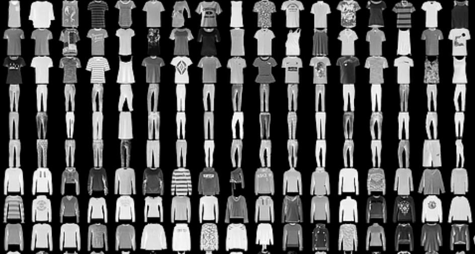
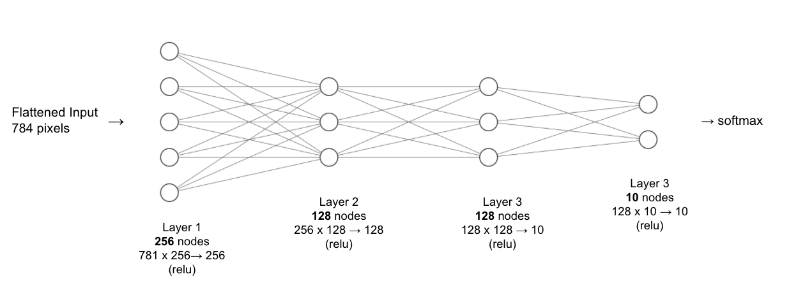

# Quantitative Methods to Rethink Generalization

This repo performs the experimental design on a Multilayer Perceptron on Fashion-MNIST dataset. 

## Abstract

In the recent decade, the massive and ever-increasing amount of multimedia data (e.g., videos, text, sounds, images) has inspired many interdisciplinary methods on data processing, analysis, recognition and inference. Machine learning is one of the most widely used approaches for multimedia-related tasks such as computer vision and speech recognition. In fact, state-of-the-art performance has been achieved by supervised or unsupervised machine learners like regression, decision trees, support vector machines, and neural networks. In this project, we applied scientific methods and experimental measurements to judge the design and limits of the machine learning models. In particular, we took an engineering approach to quantitatively measure the capacity, learnability, generalization, and resilience of a classical artificial neural network, Multilayer Perceptron, on a standard image classification dataset, Fashion-MNIST. Our work will provide valuable insights about the experimental design for neural networks on image recognition tasks. 

## Project Setup

### Dataset

The dataset we used is a standard and classical image dataset called Fashion-MNIST. Introduced by Ha Xiao and their team, Fashion-MNIST comprises of 28 ✕ 28 grayscale images of 70,000 Zalando’s fashion products from 10 categories, with 7,000 images per category. The original photos of these fashion products were shot by professional photographers and then converted into unisize, grayscale images. Each grayscale image in the dataset has 28 ✕ 28 = 784 pixels and each pixel has an 8-bit integer value ranging from 0 to 255, indicating the lightness/darkness of this pixel. In total, the training set has 60,000 images while the test set has 10,000 images. Fashion-MNIST is commonly used as the benchmark dataset for machine learning algorithms, especially computer vision models. 



### Model

The machine learner we chose to measure is a classical artificial neural network: Multilayer Perceptron (MLP). First introduced by Frank Rosenblatt in 1962 [1] and then continuously developed by the research community of artificial intelligence, MLP is a feedforward artificial network consisting of input, hidden and output layers of neurons. Each neuron maps weighted input to output and has a non-linear activation function. Under supervised setting, the training of MLP is carried through backpropagation where weights of neurons get updated based on the error in the model’s output compared to the expected result.  

In this project, we used a MLP with 1 input layer, 2 hidden layers and 1 output layer. Its input layer takes the flattened 784 image pixel values. The fully-connected layers have 256, 128, and 128, 10 nodes respectively. The model outputs a soft-maxed probabilistic prediction of the image’s class label. We chose ReLU as our activation function, cross entropy as our loss function and Adam as our optimizer. 



## Experiments

### Capacity Progression

This [notebook](CapacityProgression.ipynb) utilizes the output from *Brainome* and plots the capacity progression curve.

### Capacity Requirement Estimation

This [notebook](CapacityReq.ipynb) implements two of the Memory Equivalent Capacity estimation algorithms. One is from CS294-082's Lecture 1 & 2, the other is from prof. Gerald's [paper](https://arxiv.org/abs/1810.02328). It's our own implementaion of the code in [nntailoring repo](https://github.com/fractor/nntailoring).

### MLP on Fashion-MNIST

This [notebook](MLP-FashionMNIST.ipynb) sets up a pipeline for training and running our MLP model on Fashion-MNIST datasets. We performed the following tasks:
1. Train our model for 1, 10, 20, 30, 50, 80 epochs and check if it achieves memorization (near 100% accuracy) on training set.
2. Train our model with 10%, 30%, 50%, 70%, 100% of data and observe its performance. This should align with the capacity progression curve. 
3. Train our model for generalization. More specifically, we first reduce the Model MEC and then train it for decent accuracy. We then repeat the process until any further reduction of parameters hurt the model performance badly. 

We have integrated [Weights and Bias](https://wandb.ai/site) in our experiments. By this means, we tracked and logged the model specification, hyperparameters, performance results for every run of our experiments. The results can be access at this [interactive web platform](https://wandb.ai/maoli131/cs294-082-final). `wandb` will also automatically creates experiments tracking in the folder `wandb/`

## Experiment Guide

### Datasets

Datasets should be stored at `data/` folder. Please download the `.csv` Fashion-MNIST dataset from [Kaggle](https://www.kaggle.com/zalando-research/fashionmnist). The file name should be `train.csv` or `test.csv`. 

### Conda Environment
To run our codes smoothly, please create a virtual conda environment as following and activate it. 
```
$ conda create --name exp-design --file requirements.txt
$ conda activate exp-design
``` 
A GPU device is highly recommended. 

### Weights and Bias

To enable experiment log and tracking on your own, you should register an account at Weights and Bias [website](https://wandb.ai/site). Then simply follow the prompts in MLP-FashionMNIST notebook to login. The logs should be automatically up. Project name in `wandb` can be specified in `model_pipeline` function. 